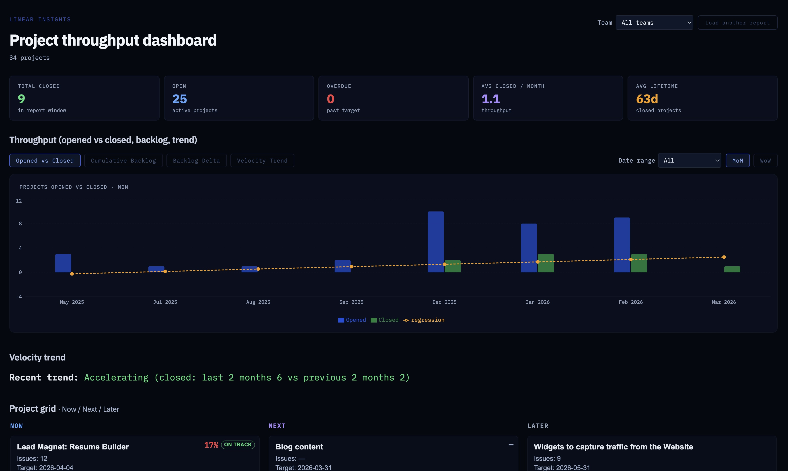

# Linear Insights



Internal tool that reads from the Linear API and surfaces insights for Product, Ops, and Leadership.

## Phase 0: CLI

- **Bun CLI** with a single `insights` command that prints a full report (teams, projects, metrics, health, velocity).
- **Shared client** in `packages/linear-client` (Linear TypeScript SDK); reused later by the TanStack Start app.

### Setup

1. **direnv** (recommended): `direnv allow` in the repo root so `.envrc` loads `.env.local`.
2. Copy env and add your key:
   ```bash
   cp .env.local.example .env.local
   # Edit .env.local: set LINEAR_API_KEY=lin_api_...
   ```
3. Install (Bun):
   ```bash
   bun install
   ```
4. Run:
   ```bash
   bun run cli
   # or: bun run insights
   ```

### CLI usage

```bash
bun run insights   # full insights report (default)
bun run cli -- insights   # same
bun run sync       # fetch and cache data only (no report)
bun run sync -- --force   # force refresh cache, then exit
```

### Optional env

- `LINEAR_API_KEY` — required for CLI sync and insights (and as fallback for the app server when not using OAuth). Set in `.env.local`.
- `LINEAR_TEAM_IDS` — comma-separated team IDs to scope active projects (optional).
- **Cache (SQLite):** Report data (teams, projects, issues) is cached in a SQLite DB. Default path: `~/.cache/linear-insights/report.db` (override with `LINEAR_INSIGHTS_CACHE_DB`). Set `LINEAR_INSIGHTS_CACHE=0` to disable. TTLs: teams 1y, projects 1d, issues 1d.
- `LINEAR_INSIGHTS_FORCE_REFRESH=1` — force cache refresh (same as `--force`).
- **Velocity chart:** An HTML bar chart (projects created/closed by month) is written to `linear-insights-velocity.html` in the current directory. Override with `LINEAR_INSIGHTS_CHART_OUTPUT=/path/to/file.html`. Set `LINEAR_INSIGHTS_CHART=nodeplotlib` to also open an interactive Plotly chart in the browser (via nodeplotlib).

### OAuth (web app — hosted / multi-user)

The web app supports **Linear OAuth 2.0** so users sign in with their own Linear accounts instead of sharing a single API key.

#### 1. Create a Linear OAuth app

Go to **Linear → Settings → API → OAuth Applications → New application**.

- **Redirect URI:** `http://localhost:5173/auth/callback` for local dev; set to your hosted domain for production.
- **Scopes:** `read`

#### 2. Set additional env vars in `.env.local`

```bash
LINEAR_CLIENT_ID=your_oauth_client_id
LINEAR_CLIENT_SECRET=your_oauth_client_secret
LINEAR_REDIRECT_URI=http://localhost:5173/auth/callback
SESSION_SECRET=at-least-32-random-characters-here
```

#### 3. Start the app

```bash
bun run app:dev
```

Open [http://localhost:5173](http://localhost:5173) — you will be redirected to Linear to sign in.

#### Auth endpoints (served by the report API on port 3001)

| Endpoint | Method | Description |
|---|---|---|
| `/auth/login` | `GET` | Redirect to Linear OAuth consent |
| `/auth/callback` | `GET` | Exchange code, issue signed session cookie |
| `/auth/logout` | `POST` | Clear session cookie |
| `/auth/me` | `GET` | Return `{ userId, name, email }` or 401 |

#### Session design

- Sessions are **stateless signed cookies** (`linear_session`): the Linear access token is stored in an HMAC-SHA256 signed cookie payload. No server-side session store required.
- Cache is **scoped per user** via the Linear user ID — each user's data is isolated in the SQLite cache.
- **Fallback**: if `LINEAR_API_KEY` is set but no OAuth credentials are configured, the app server still accepts API key auth for local development without a login flow.

#### Future: KV cache migration

The cache layer uses a `CacheAdapter` interface (`packages/cache/src/adapter.ts`). The current `SQLiteCacheAdapter` is suitable for a single process. To run multiple instances (e.g. on Vercel), swap it for a `RedisCacheAdapter` or `VercelKVCacheAdapter` that implements the same three-method interface:

```ts
interface CacheAdapter {
  get(scope, kind, key): Promise<CacheEntry | null>
  set(scope, kind, key, data, expiresAt): Promise<void>
  clear(scope): Promise<void>
}
```

### Repo layout (layers)

- **packages/linear-client** — Linear API client (teams, projects, issues, metrics, health, velocity, lifecycle, objectives). No cache.
- **packages/cache** — SQLite cache optimized for report data (get/set teams, projects, issues by scope).
- **packages/report-data** — Data layer: cache-first access + sync orchestration (`syncLinearData`) for teams/projects/issues/timelines.
- **packages/data-sync** — Backward-compatible shim that re-exports sync from `report-data` (deprecated; kept for compatibility).
- **packages/report-build** — Builds `InsightsReportData` from cached teams/projects/issues (used by CLI and app server).
- **apps/cli** — Insights command; uses report-data and report-build. Reusable UI in **apps/cli/src/components**.
- **apps/app** — Web dashboard (Vite + React). UI components live in `apps/app/src/components`; report data helpers in `apps/app/src/lib`.

### Run the app

From repo root: `bun run app:dev`. This starts the report API (syncs cache if needed, serves JSON) and the app; the app opens with the report loaded automatically. See `apps/app/README.md` for details.

### If the CLI hangs or times out

- Each Linear API step has a **30s timeout**; you’ll see e.g. `Fetching teams timed out after 30s` if it doesn’t respond.
- Check: **network** (can you reach `https://api.linear.app`?), **firewall/VPN**, and that **LINEAR_API_KEY** is valid (create one at Linear → Settings → API).

## Later: TanStack Start app

After the CLI phase, the web app will depend on `@linear-insights/linear-client` and expose Product, Ops, and Roadmap views.

## Known issues / technical debt

### Critical

- **`listIssuesByProject` only returns the last page** (`packages/linear-client/src/issues.ts`): the pagination loop overwrites `connection` on each page and then returns only the final page's nodes. Projects with more than 50 issues silently drop all but the last 50, corrupting completion %, stale counts, and velocity. The correct pattern (accumulate into an array) is already used in `teams.ts` and `projects.ts`.

### Medium

- **`computeProjectHealth` dead branch** (`packages/linear-client/src/health.ts`): both the `else if` and the `else` return `"at_risk"`, so `"off_track"` is never assigned through the main path. Projects severely behind schedule are indistinguishable from mildly at-risk ones.
- **Outer issue-fetch timeout is a no-op** (`apps/cli/src/commands/insights/insights.command.ts`): the outer timeout is `Math.max(REQUEST_TIMEOUT_MS, projectIds.length * 2)`. For any realistic project count the `Math.max` always returns `REQUEST_TIMEOUT_MS`, providing no extra buffer. Should be `projectIds.length * REQUEST_TIMEOUT_MS`.
- **No tests**: the pure computation functions in `packages/linear-client` (`computeProjectMetrics`, `computeProjectHealth`, `computeVelocity`, `getStaleIssues`) and `packages/report-build` (`buildInsightsReport`) take plain data and return plain data — ideal candidates for unit tests.

### Low

- **Duplicate type definitions**: `ProjectsPerMonth`, `VelocityTrend`, and `VelocitySummary` are defined independently in both `packages/linear-client/src/types.ts` and `packages/report-types/src/index.ts`. One should import from the other.
- **Unused dependencies**: `inquirer` and `@pppp606/ink-chart` are listed in `apps/cli/package.json` but not used.
- **Inconsistent name truncation**: in `packages/report-build/src/index.ts`, project names are sliced to four different lengths (20, 22, 24, 28) across report sections, so the same project appears under a different truncated name in each CLI table.
- **`packages/data-sync`** is a one-line deprecated re-export shim; safe to remove once confirmed no external callers remain.
